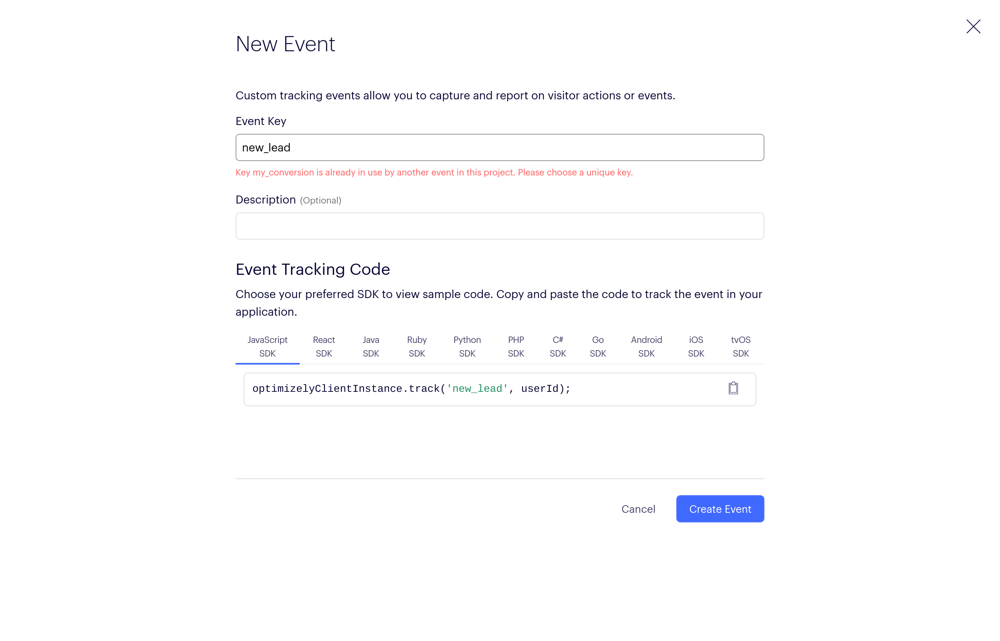
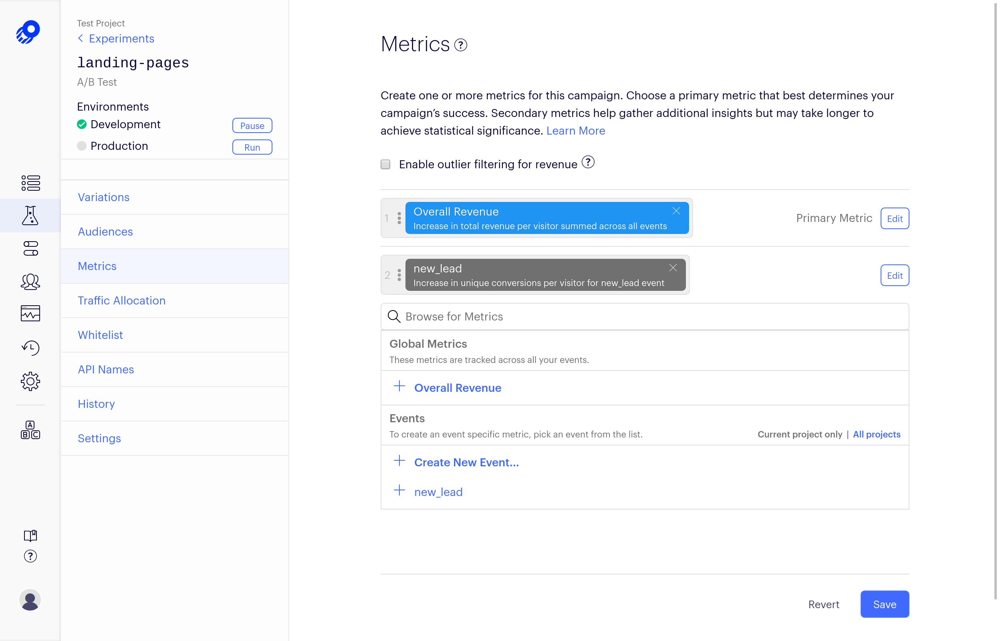

This project contains an example of [Optimizely](https://www.optimizely.com/) A/B test implementation in Typescript

Optimizely provides a JavaScript a SDK and the documentation could be found [here](https://docs.developers.optimizely.com/rollouts/docs/javascript-node).

This project depends on:

### Dependencies ###

* [@optimizely/optimizely-sdk](https://github.com/optimizely/javascript-sdk/tree/master/packages/optimizely-sdk) npm package 

### How do I get set up? ###

To run this project locally, first of all you need to clone this repository, the project had the following requirements: 

#### Requirements ####

* npm
* webpack and webpack-dev
* docker
* docker compose
* ts-node

The second step its to run the folowing command to install optimizely dependency:

```
npm install --save @optimizely/optimizely-sdk
```

After that, run the following command to generate an updated bundle: 

```
webpack
```

now you can run the following command to up your container: 

```
docker-compose up -d
```

The application will be accessible by the following url: http://optimizely.localtest.me/

### About the test ###

To run an AB test using optimizely you need to create an account on [optimizely platform](https://www.optimizely.com/). After that, you need to create an FullStack project. 

With a FullStack project created, the first step to make your AB test is to get your SDK key to access your account on your code. To do that, go to "settings" menu on "Environments" tab. 

You will see a page like this:


Use the SDK key of your desired environment to create an instance of optimizely client:

```typescript
optimizely.createInstance({
    sdkKey: "HTeqyYASMHXBgz4HhfXWh8",
    datafileOptions: {
        autoUpdate: true,
        updateInterval: 1000,  // 1 second in milliseconds
    },
});
```

Now, lets create an AB test experiment on optimizely account. Go to "Experiments" menu and click on "Create New.." button, select "A/B Test" option. 

The following page will be shown:


Create an experiment key and, optionally, a description. On this test we will follow creating the expriment key "landing-pages".

The next page looks like this: 


Here we have created 2 variables: "landing-page-1" and "landing-page-2". This variables was set to a traffic distribution of 50%, that means that 50% of users will see landing-page-1 and 50% will see landing-page-2.

Copy the snippet and paste to your code.

```typescript
var variation = optimizelyClientInstance.activate('landing-pages', userId);
if (variation === 'landing-page-1') {
  // execute code for landing-page-1
} else if (variation === 'landing-page-2') {
  // execute code for landing-page-2
} else {
  // execute default code
}
```

Now, go to "Metrics" menu and add "Overall Revenue" and save


If you look closely at the code, the variable "userId" was not assigned, thats because your application needs to pass what identifies their users, it could be an email, an uuid, a name..

Here, let's say that what identifies our users are your name and let's create some users:

```typescript
let users = [
    { userId: 'alice', },
    { userId: 'bob', },
    { userId: 'charlie', },
    { userId: 'don', },
    { userId: 'eli', },
    { userId: 'fabio', },
    { userId: 'gary', },
    { userId: 'helen', },
    { userId: 'ian', },
    { userId: 'jill', },
];
```

Now merge all code snippets to make sense and lets run this example: 

```typescript
let optimizelyClientInstance = optimizely.createInstance({
    sdkKey: "HTeqyYASMHXBgz4HhfXWh8",
    datafileOptions: {
        autoUpdate: true,
        updateInterval: 1000,  // 1 second in milliseconds
    },
});

let users = [
    { userId: 'alice', },
    { userId: 'bob', },
    { userId: 'charlie', },
    { userId: 'don', },
    { userId: 'eli', },
    { userId: 'fabio', },
    { userId: 'gary', },
    { userId: 'helen', },
    { userId: 'ian', },
    { userId: 'jill', },
];

users.forEach(user => {
    var variation = optimizelyClientInstance.activate('landing-pages', user.userId);
    if (variation === 'landing-page-1') {
        document.body.innerText += `showing landing-page-1 for user ${user.userId}` + '\n';
    } else if (variation === 'landing-page-2') {
        document.body.innerText += `showing landing-page-2 for user ${user.userId}` + '\n';
    } else {
        document.body.innerText += `experiment disabled for user ${user.userId}` + '\n';
    }
});

```

Now, go to development environment of your projet and click in "run" button to enable your test and execute the code. An output like that will be shown: 

```
showing landing-page-1 for user alice
showing landing-page-2 for user bob
showing landing-page-1 for user charlie
showing landing-page-2 for user don
showing landing-page-1 for user eli
showing landing-page-2 for user fabio
showing landing-page-2 for user gary
showing landing-page-2 for user helen
showing landing-page-2 for user ian
showing landing-page-1 for user jill
```

Here we have a code that distributes two different pages across the users, but we don't have any metric that collects wich one takes more effect. On our example we will try to simulate wich page brings more leads. To simulate that, we will use a random boolean variable that represents if current user you buy our product or not and send a track information to optimizely if true.

```typescript
let userIslead = !(+new Date()%2);
if(userIslead){
    document.body.innerText += `user ${user.userId} is a lead!` + '\n';
    optimizelyClientInstance.track('new_lead', user.userId, {}, { revenue: 1 });
}
```

Now, we need to create "new_lead" event on optimizely. Go to "Events" menu and click on "New Event" button. 



Go to "Experiments" menu, select "landing-pages", go to "Metrics" and add "new_lead" event to the project. 



and execute you code. An output like this will be shown:

```
showing landing-page-1 for user alice
user alice is a lead!
showing landing-page-2 for user bob
showing landing-page-1 for user charlie
showing landing-page-2 for user don
user don is a lead!
showing landing-page-1 for user eli
user eli is a lead!
showing landing-page-2 for user fabio
user fabio is a lead!
showing landing-page-2 for user gary
user gary is a lead!
showing landing-page-2 for user helen
showing landing-page-2 for user ian
user ian is a lead!
showing landing-page-1 for user jill
```

Looking for this output, we have that 2 users looking landing-page-1 have been converted to a lead and 4 users looking landing-page-2 have been converted. 

Now, go to your experiment on Optimizely and click on "Results" button. This analisys will be shown with all the attributes and tags passed on "track" function:

